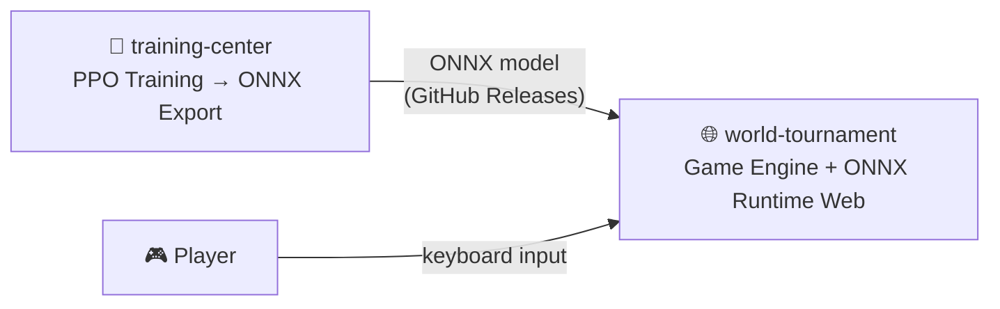

# world-tournament

Web demo for [alphachu-volleyball](https://github.com/alphachu-volleyball) — play against RL-trained AI in your browser.

> **Original game**: Pikachu Volleyball (対戦ぴかちゅ～　ﾋﾞｰﾁﾊﾞﾚｰ編)
> — 1997 (C) SACHI SOFT / SAWAYAKAN Programmers, Satoshi Takenouchi
>
> **Reverse-engineered JS**: [gorisanson/pikachu-volleyball](https://github.com/gorisanson/pikachu-volleyball)

## Overview

A web demo where you can play Pikachu Volleyball against an RL-trained AI directly in your browser.

- **Game Engine**: Based on [gorisanson/pikachu-volleyball](https://github.com/gorisanson/pikachu-volleyball)
- **AI Inference**: In-browser model inference via [ONNX Runtime Web](https://onnxruntime.ai/)
- **Deployment**: Static site on GitHub Pages

### How It Works



1. [training-center](https://github.com/alphachu-volleyball/training-center) trains RL models and exports them as ONNX
2. world-tournament fetches the ONNX model from GitHub Releases
3. When a user opens the page, ONNX Runtime Web loads the model and runs it as the AI player

## Quick Start

```bash
# Install
npm install

# Dev server
npm run dev

# Build
npm run build

# Lint
npm run lint
```

## Development

See [CLAUDE.md](CLAUDE.md) for the full development guide.

### Branch Workflow

```
feat/* ──(squash)──► main ──(auto deploy)──► GitHub Pages
```

## Related Projects

- [alphachu-volleyball/pika-zoo](https://github.com/alphachu-volleyball/pika-zoo) — Pikachu Volleyball RL environment (Python)
- [alphachu-volleyball/training-center](https://github.com/alphachu-volleyball/training-center) — RL training pipeline
- [gorisanson/pikachu-volleyball](https://github.com/gorisanson/pikachu-volleyball) — Reverse-engineered JS reimplementation
